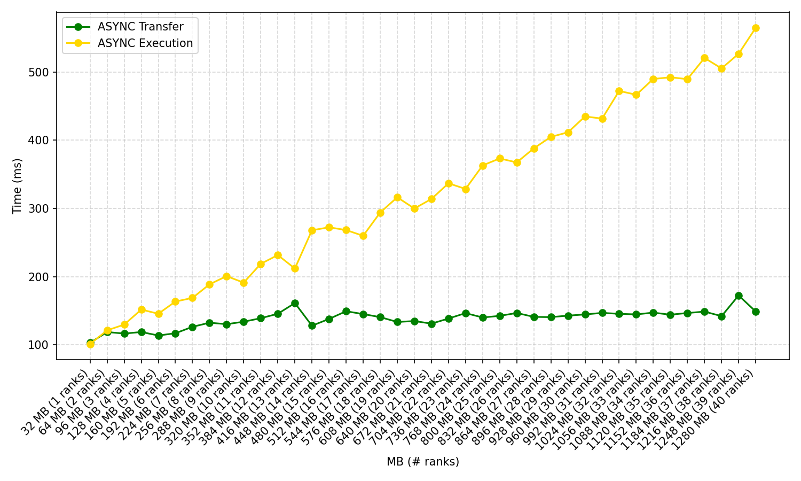
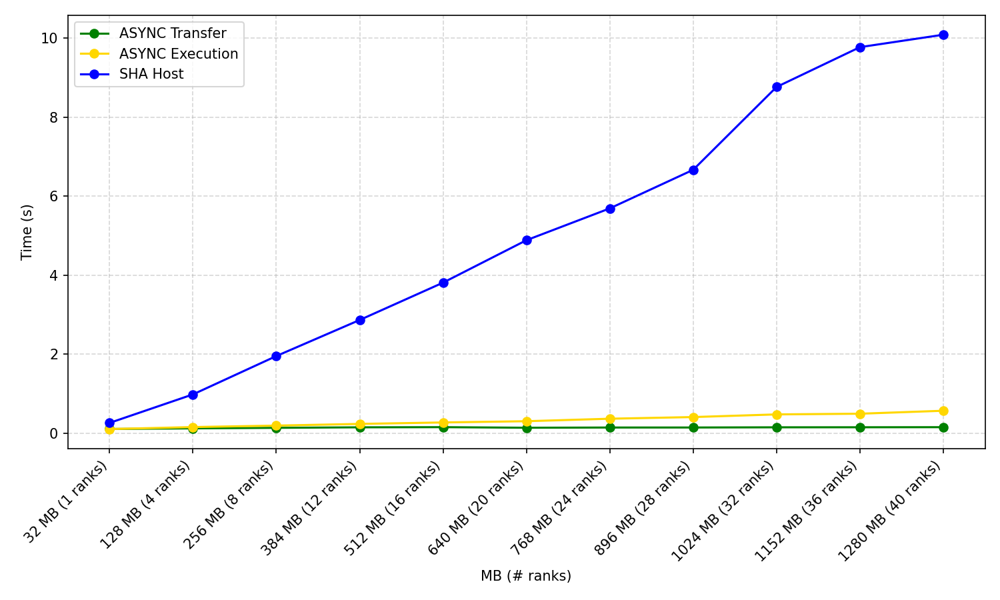
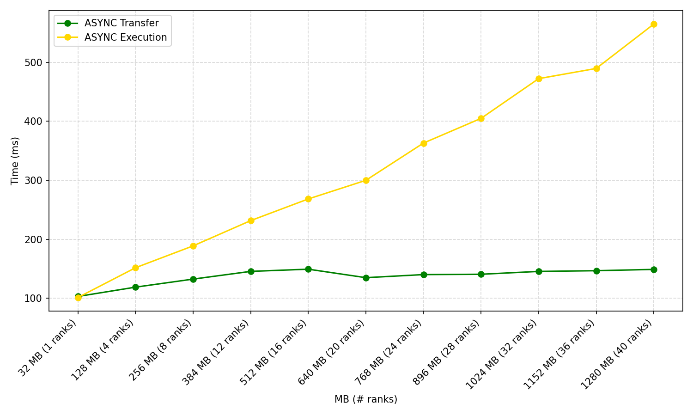

# Repository
This repository contains an implementation of SHA-256 designed to run on multiple ranks of the UPMEM PIM architecture. Each DPU is fed a fixed amount of data, and a weak scaling is performed analyzing the time required to perform the hashing by the PIM architecture following two parallel schemes: Asynchronous Rank Transfer and Asynchronous Rank Execution. Results are compared to those obtained by SHA256_Host (the same SHA-256 implementation used by the DPUs, executed on the Host CPU).


## Single Run
Compile the DPU program
```
dpu-upmem-dpurte-clang -DSTACK_SIZE_DEFAULT=2400 -O2 SHA256DPU.c -o dpu
```
Compile the host program, specifyin ght number of ranks to use in `DRANKITER`
```
gcc --std=c11 -DASYNCEXEC -DASYNCTRANS -DSHAHOST -DRANKITER=1 -O2 SHA256Host.c -o ranks_scaling_sha256 `dpu-pkg-config --cflags --libs dpu`
```
The following flags can be used to determine which algorithms are run:
* **DASYNCTRANS**: Asynchronous rank transfer (PIM)
* **DASYNCEXEC**: Asynchronous rank execution (PIM)
* **DSHAHOST**: Software hashing on Host CPU (using the same SHA256 implementation as the DPU, for both to compare performance and to check the correctness of digests)

`NR_TASKLETS` per DPU is fixed to 16.
`MESSAGE_SIZE` is defined `common.h` and represents the amount of data taht each tasklet should hash (32KB by default)

Run the compiled file
```
./ranks_scaling_sha256
```

## One-shot run
It is possible to directly run the script `run_ranks_scaling_sha256.sh` to execute the program multiple times increasing the number of ranks by 1 at every iteration. This will produce a `rank_scaling_sha256.csv` file that can be used by the plotting script described below.

## Plotting
Once `rank_scaling_sha256.csv` is generated, it is possible to generate the plot using the python script `plot_ranks_scaling_sha256.py`

```
python plot_ranks_scaling_sha256.py
```





To simplify the plot, it is possible to generate a reduced version in which only certain values are plotted (with number of ranks equal to 1, 4, 8, 12, 16, 20, 24, 28, 32, 36, 40) using the following flag:

```
python plot_ranks_scaling_sha256.py --filter-by-ranks
```



